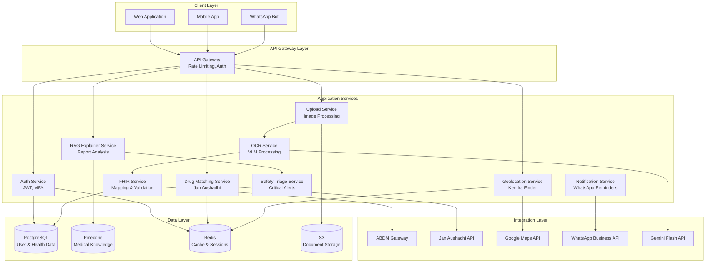

# Design Document: ABHA-Sync

## Overview

ABHA-Sync is a comprehensive digital health platform that bridges India's legacy paper-based health records with the modern ABDM digital ecosystem. The system employs a microservices architecture with three core pipelines:

1. **Legacy-to-FHIR Pipeline**: Transforms handwritten prescriptions and lab reports into standardized FHIR R4 resources using Vision-Language Models
2. **Jan Aushadhi Smart-Switch**: Intelligent drug matching engine that identifies affordable generic alternatives
3. **Responsible AI Report Explainer**: RAG-based system that provides patient-friendly explanations of medical reports with safety triage

The platform prioritizes patient privacy (DPDP Act compliance), medical safety (no diagnostic claims), and accessibility (multi-language support, offline capability).

### Key Design Principles

- **Privacy-First**: End-to-end encryption, data minimization, and explicit consent management
- **Safety-Focused**: Clear disclaimers, critical alert detection, and responsible AI boundaries
- **Interoperability**: FHIR R4 compliance and ABDM integration for seamless health data exchange
- **Accessibility**: Multi-language support, mobile-responsive design, and offline capability
- **Scalability**: Asynchronous processing, horizontal scaling, and efficient caching strategies

## Architecture

### System Architecture



### Technology Stack

**Backend Services**:
- Python 3.11+ with FastAPI for core services (OCR, FHIR, RAG, Triage)
- Node.js 20+ with Express for high-concurrency services (Notifications, WebSocket)
- PostgreSQL 15+ for relational data (users, health records, audit logs)
- Redis 7+ for caching, session management, and rate limiting
- Pinecone for vector storage (medical knowledge base for RAG)

**AI/ML Components**:
- Google Gemini Flash 1.5 for VLM-based OCR
- LangChain for RAG pipeline orchestration
- Sentence Transformers for medical text embeddings
- Fuzzy matching libraries (RapidFuzz) for drug name normalization

**External Integrations**:
- ABDM Gateway APIs for health data exchange
- Jan Aushadhi public API for generic drug registry
- Google Maps APIs (Geocoding, Places, Directions)
- WhatsApp Business API for notifications

**Infrastructure**:
- Docker containers with Kubernetes orchestration
- AWS S3 for document storage with encryption
- CloudFront CDN for static assets
- AWS Lambda for serverless background jobs


## Components and Interfaces

### 1. Upload Service

**Responsibility**: Handle document uploads, validation, and preprocessing

**Interface**:
```python
class UploadService:
    def upload_document(
        user_id: str,
        file: UploadFile,
        document_type: DocumentType
    ) -> UploadResponse:
        """
        Upload and validate health document
        
        Args:
            user_id: Authenticated user identifier
            file: Uploaded file (image or PDF)
            document_type: PRESCRIPTION | LAB_REPORT | MEDICAL_RECORD
            
        Returns:
            UploadResponse with document_id and processing_status
            
        Raises:
            ValidationError: Invalid file format or size
            StorageError: S3 upload failure
        """
        
    def get_upload_status(document_id: str) -> ProcessingStatus:
        """Query processing status of uploaded document"""
        
    def compress_image(image: bytes, target_size_mb: int) -> bytes:
        """Compress image while maintaining OCR quality"""
```

**Implementation Notes**:
- Accept JPEG, PNG, PDF, HEIC formats
- Maximum file size: 10MB (compress if larger)
- Store original in S3 with AES-256 encryption
- Generate presigned URLs for secure access (1-hour expiry)
- Emit events to OCR service queue for async processing

### 2. OCR Service

**Responsibility**: Extract text and medical entities from document images using VLM

**Interface**:
```python
class OCRService:
    def process_document(document_id: str) -> OCRResult:
        """
        Extract text and entities from health document
        
        Args:
            document_id: Reference to uploaded document
            
        Returns:
            OCRResult containing extracted text, entities, and confidence scores
        """
        
    def extract_entities(text: str) -> List[MedicalEntity]:
        """
        Extract structured medical entities from text
        
        Entities: drug_name, dosage, frequency, diagnosis, test_name, test_value
        """
        
    def normalize_drug_name(raw_name: str) -> DrugName:
        """Normalize drug names using fuzzy matching against known database"""
```

**VLM Prompt Strategy**:
```
You are a medical document OCR system. Extract the following from this prescription/lab report:

For Prescriptions:
- Patient name and age
- Doctor name and registration number
- Date of prescription
- Medications: For each medication, extract:
  * Drug name (brand or generic)
  * Dosage (e.g., "500mg")
  * Frequency (e.g., "twice daily", "1-0-1")
  * Duration (e.g., "7 days")
- Diagnoses or symptoms mentioned
- Special instructions

For Lab Reports:
- Patient name and age
- Lab name and date
- Test name
- Test value with units
- Reference range
- Abnormal flags (if any)

Return structured JSON with confidence scores for each field.
If handwriting is unclear, mark confidence as LOW and include your best guess.
```

**Entity Extraction Pipeline**:
1. Call Gemini Flash API with document image and structured prompt
2. Parse JSON response into MedicalEntity objects
3. Validate extracted entities (dosage formats, test value ranges)
4. Apply fuzzy matching for drug names (threshold: 85% similarity)
5. Flag low-confidence extractions (< 70%) for manual review
6. Store results in PostgreSQL with confidence metadata

### 3. FHIR Mapping Service

**Responsibility**: Convert extracted health data into FHIR R4 resources

**Interface**:
```python
class FHIRService:
    def create_fhir_bundle(ocr_result: OCRResult, patient_id: str) -> FHIRBundle:
        """
        Create FHIR bundle from OCR results
        
        Returns:
            FHIRBundle containing Patient, MedicationRequest, Observation, etc.
        """
        
    def validate_fhir_resource(resource: FHIRResource) -> ValidationResult:
        """Validate FHIR resource against R4 schema"""
        
    def submit_to_abdm(bundle: FHIRBundle, consent_id: str) -> ABDMResponse:
        """Submit FHIR bundle to ABDM Gateway with consent"""
```

**FHIR Resource Mapping**:

| Extracted Data | FHIR Resource | Key Fields |
|----------------|---------------|------------|
| Patient demographics | Patient | name, birthDate, identifier (ABHA) |
| Prescription medication | MedicationRequest | medicationCodeableConcept, dosageInstruction, authoredOn |
| Lab test result | Observation | code (LOINC), value, referenceRange, interpretation |
| Diagnosis | Condition | code (ICD-10), clinicalStatus, recordedDate |
| Complete document | DocumentReference | content (base64), type, date |

**FHIR Validation**:
- Use official FHIR validator library (fhir.resources Python package)
- Validate required fields, data types, and cardinality
- Check code system bindings (LOINC for labs, RxNorm for drugs)
- Log validation errors with specific field paths
- Prevent submission of invalid resources to ABDM

### 4. Drug Matching Service

**Responsibility**: Match brand-name drugs to Jan Aushadhi generic equivalents

**Interface**:
```python
class DrugMatchingService:
    def find_generic_alternatives(
        brand_name: str
    ) -> List[GenericAlternative]:
        """
        Find generic alternatives for brand-name drug
        
        Returns:
            List of GenericAlternative with molecule, price, savings
        """
        
    def calculate_savings(
        brand_price: float,
        generic_price: float,
        quantity: int
    ) -> SavingsAnalysis:
        """Calculate cost savings with percentage and absolute values"""
        
    def refresh_registry_cache() -> None:
        """Weekly refresh of Jan Aushadhi registry data"""
```

**Matching Algorithm**:
1. Extract active molecule from brand name using drug database
2. Query Jan Aushadhi registry for molecule matches
3. Rank results by price (lowest first)
4. Calculate savings: `(brand_price - generic_price) / brand_price * 100`
5. Return top 3 alternatives with availability status

**Caching Strategy**:
- Cache Jan Aushadhi registry locally in Redis
- TTL: 7 days (weekly refresh)
- Cache key: `jan_aushadhi:molecule:{molecule_name}`
- Fallback to cached data if API unavailable

### 5. Geolocation Service

**Responsibility**: Find nearest Jan Aushadhi Kendras using geospatial queries

**Interface**:
```python
class GeolocationService:
    def find_nearest_kendras(
        latitude: float,
        longitude: float,
        radius_km: int = 25
    ) -> List[KendraLocation]:
        """Find Kendras within radius sorted by distance"""
        
    def geocode_address(address: str) -> Coordinates:
        """Convert address/pincode to GPS coordinates"""
        
    def get_navigation_url(
        origin: Coordinates,
        destination: KendraLocation
    ) -> str:
        """Generate Google Maps navigation URL"""
```

**Implementation**:
- Store Kendra locations in PostgreSQL with PostGIS extension
- Use spatial index for efficient radius queries
- Query: `SELECT * FROM kendras WHERE ST_DWithin(location, ST_MakePoint(lon, lat)::geography, 25000) ORDER BY ST_Distance(location, ST_MakePoint(lon, lat))`
- Cache geocoding results for 30 days
- Generate Google Maps URLs: `https://www.google.com/maps/dir/?api=1&origin={lat},{lon}&destination={kendra_lat},{kendra_lon}`

### 6. RAG Explainer Service

**Responsibility**: Generate patient-friendly explanations of lab reports using RAG

**Interface**:
```python
class RAGExplainerService:
    def explain_lab_report(
        test_results: List[LabTest]
    ) -> List[TestExplanation]:
        """
        Generate simple explanations for lab test results
        
        Returns:
            List of TestExplanation with plain-language descriptions
        """
        
    def retrieve_medical_context(
        test_name: str,
        test_value: float
    ) -> List[Document]:
        """Retrieve relevant medical knowledge from vector DB"""
```

**RAG Pipeline**:
1. **Retrieval Phase**:
   - Embed test name using Sentence Transformers
   - Query Pinecone for top 5 relevant medical documents
   - Filter by relevance score (> 0.7)

2. **Augmentation Phase**:
   - Construct prompt with retrieved context
   - Include test value, reference range, and patient demographics
   - Add safety instructions (avoid diagnosis, recommend doctor consultation)

3. **Generation Phase**:
   - Call LLM (GPT-4 or Gemini) with augmented prompt
   - Parse response into structured explanation
   - Validate output for prohibited medical advice

**Prompt Template**:
```
You are a health literacy assistant. Explain this lab test result in simple terms.

Test: {test_name}
Patient Value: {test_value} {unit}
Normal Range: {reference_range}

Context from medical literature:
{retrieved_documents}

Provide a brief explanation (2-3 sentences) that:
1. Explains what this test measures
2. Indicates if the value is normal, high, or low
3. Uses simple language avoiding medical jargon
4. Does NOT provide diagnosis or treatment advice
5. Recommends consulting a doctor if abnormal

Explanation:
```

**Vector Database Setup**:
- Index medical knowledge base (MedlinePlus, WHO health topics)
- Chunk documents into 512-token segments
- Generate embeddings using `all-MiniLM-L6-v2` model
- Store in Pinecone with metadata (source, date, topic)

### 7. Safety Triage Service

**Responsibility**: Detect critical health anomalies requiring immediate medical attention

**Interface**:
```python
class SafetyTriageService:
    def analyze_critical_values(
        test_results: List[LabTest]
    ) -> TriageResult:
        """
        Detect critical lab values requiring immediate attention
        
        Returns:
            TriageResult with alert_level (NORMAL | WARNING | CRITICAL)
        """
        
    def get_critical_thresholds(test_name: str) -> CriticalRange:
        """Retrieve evidence-based critical value thresholds"""
```

**Critical Value Thresholds** (Evidence-Based):

| Test | Critical Low | Critical High | Source |
|------|--------------|---------------|--------|
| Glucose (fasting) | < 50 mg/dL | > 400 mg/dL | ADA Guidelines |
| Hemoglobin | < 7 g/dL | > 20 g/dL | WHO Standards |
| Creatinine | - | > 5 mg/dL | KDIGO Guidelines |
| Potassium | < 2.5 mEq/L | > 6.5 mEq/L | Clinical Chemistry |
| WBC Count | < 2000/μL | > 30000/μL | Hematology Standards |

**Alert Generation**:
- Compare test values against critical thresholds
- Generate alert level: NORMAL, WARNING (outside reference range), CRITICAL (life-threatening)
- For CRITICAL: Display prominent "Consult Doctor Immediately" message
- Include specific tests triggering alert
- Log all alerts for audit trail

### 8. Notification Service

**Responsibility**: Send medication reminders via WhatsApp

**Interface**:
```python
class NotificationService:
    def schedule_medication_reminders(
        user_id: str,
        medications: List[MedicationSchedule]
    ) -> None:
        """Schedule WhatsApp reminders for medication times"""
        
    def send_reminder(
        phone_number: str,
        medication: MedicationSchedule
    ) -> DeliveryStatus:
        """Send individual medication reminder"""
        
    def handle_user_response(
        phone_number: str,
        message: str
    ) -> None:
        """Process user responses to reminders (adherence tracking)"""
```

**WhatsApp Integration**:
- Use WhatsApp Business API with approved message templates
- Template: "Medication Reminder: Take {drug_name} {dosage} now. Reply DONE when taken."
- Schedule reminders using cron jobs or task queue (Celery)
- Store reminder schedule in PostgreSQL
- Track delivery status via webhooks
- Log adherence when user responds

**Reminder Scheduling**:
- Parse medication frequency: "twice daily" → 8 AM, 8 PM
- Parse frequency codes: "1-0-1" → Morning, Afternoon, Night
- Calculate reminder times based on user timezone
- Stop reminders when course duration expires
- Support snooze (30 min) and custom time adjustments


## Data Models

### Core Entities

#### User
```python
class User:
    user_id: UUID
    phone_number: str  # Primary identifier
    abha_number: Optional[str]  # ABDM Health ID
    email: Optional[str]
    preferred_language: LanguageCode  # en, hi, ta, te, bn, mr
    created_at: datetime
    last_login: datetime
    consent_given: bool  # DPDP Act consent
    
    # Relationships
    health_records: List[HealthRecord]
    medication_schedules: List[MedicationSchedule]
```

#### HealthRecord
```python
class HealthRecord:
    record_id: UUID
    user_id: UUID  # Foreign key to User
    document_type: DocumentType  # PRESCRIPTION | LAB_REPORT | MEDICAL_RECORD
    upload_date: datetime
    original_document_url: str  # S3 presigned URL
    processing_status: ProcessingStatus  # PENDING | PROCESSING | COMPLETED | FAILED
    
    # OCR Results
    extracted_text: Optional[str]
    entities: List[MedicalEntity]
    confidence_score: float  # 0.0 to 1.0
    
    # FHIR Data
    fhir_bundle: Optional[dict]  # JSON representation
    fhir_bundle_id: Optional[str]  # ABDM reference
    
    # Metadata
    created_by: str  # Doctor name (if extracted)
    record_date: Optional[date]  # Date on document
    manual_review_required: bool
```

#### MedicalEntity
```python
class MedicalEntity:
    entity_id: UUID
    record_id: UUID  # Foreign key to HealthRecord
    entity_type: EntityType  # DRUG | DIAGNOSIS | TEST | SYMPTOM
    raw_text: str  # As extracted from OCR
    normalized_value: str  # After fuzzy matching/normalization
    confidence: float
    
    # Drug-specific fields
    dosage: Optional[str]  # "500mg"
    frequency: Optional[str]  # "twice daily", "1-0-1"
    duration: Optional[str]  # "7 days"
    
    # Lab test-specific fields
    test_value: Optional[float]
    test_unit: Optional[str]
    reference_range: Optional[str]
    is_abnormal: Optional[bool]
```

#### GenericAlternative
```python
class GenericAlternative:
    alternative_id: UUID
    brand_drug_name: str
    generic_drug_name: str
    active_molecule: str
    brand_price: float  # INR
    generic_price: float  # INR
    savings_percentage: float
    savings_amount: float
    jan_aushadhi_available: bool
    last_updated: datetime
```

#### KendraLocation
```python
class KendraLocation:
    kendra_id: UUID
    name: str
    address: str
    city: str
    state: str
    pincode: str
    latitude: float
    longitude: float
    phone_number: Optional[str]
    operating_hours: Optional[str]
    
    # PostGIS geography column for spatial queries
    location: Geography  # POINT(longitude latitude)
```

#### MedicationSchedule
```python
class MedicationSchedule:
    schedule_id: UUID
    user_id: UUID
    medication_name: str
    dosage: str
    frequency: str  # Parsed into reminder times
    start_date: date
    end_date: date
    reminder_times: List[time]  # [08:00, 20:00] for "twice daily"
    active: bool
    
    # Adherence tracking
    reminders_sent: int
    reminders_acknowledged: int
    adherence_rate: float  # acknowledged / sent
```

#### TestExplanation
```python
class TestExplanation:
    explanation_id: UUID
    record_id: UUID
    test_name: str
    test_value: float
    test_unit: str
    reference_range: str
    is_normal: bool
    explanation_text: str  # Patient-friendly explanation
    alert_level: AlertLevel  # NORMAL | WARNING | CRITICAL
    generated_at: datetime
```

#### AuditLog
```python
class AuditLog:
    log_id: UUID
    user_id: Optional[UUID]
    action: str  # LOGIN | UPLOAD | EXPORT | DELETE | ACCESS
    resource_type: str  # USER | HEALTH_RECORD | FHIR_BUNDLE
    resource_id: Optional[UUID]
    ip_address: str
    user_agent: str
    timestamp: datetime
    success: bool
    error_message: Optional[str]
```

### Database Schema

**PostgreSQL Tables**:

```sql
-- Users table
CREATE TABLE users (
    user_id UUID PRIMARY KEY DEFAULT gen_random_uuid(),
    phone_number VARCHAR(15) UNIQUE NOT NULL,
    abha_number VARCHAR(20) UNIQUE,
    email VARCHAR(255),
    preferred_language VARCHAR(5) DEFAULT 'en',
    created_at TIMESTAMP DEFAULT NOW(),
    last_login TIMESTAMP,
    consent_given BOOLEAN DEFAULT FALSE,
    password_hash VARCHAR(255) NOT NULL
);

-- Health records table
CREATE TABLE health_records (
    record_id UUID PRIMARY KEY DEFAULT gen_random_uuid(),
    user_id UUID REFERENCES users(user_id) ON DELETE CASCADE,
    document_type VARCHAR(50) NOT NULL,
    upload_date TIMESTAMP DEFAULT NOW(),
    original_document_url TEXT NOT NULL,
    processing_status VARCHAR(20) DEFAULT 'PENDING',
    extracted_text TEXT,
    confidence_score FLOAT,
    fhir_bundle JSONB,
    fhir_bundle_id VARCHAR(255),
    created_by VARCHAR(255),
    record_date DATE,
    manual_review_required BOOLEAN DEFAULT FALSE,
    
    INDEX idx_user_records (user_id, upload_date DESC),
    INDEX idx_processing_status (processing_status)
);

-- Medical entities table
CREATE TABLE medical_entities (
    entity_id UUID PRIMARY KEY DEFAULT gen_random_uuid(),
    record_id UUID REFERENCES health_records(record_id) ON DELETE CASCADE,
    entity_type VARCHAR(50) NOT NULL,
    raw_text TEXT NOT NULL,
    normalized_value TEXT,
    confidence FLOAT NOT NULL,
    dosage VARCHAR(50),
    frequency VARCHAR(100),
    duration VARCHAR(50),
    test_value FLOAT,
    test_unit VARCHAR(20),
    reference_range VARCHAR(100),
    is_abnormal BOOLEAN,
    
    INDEX idx_record_entities (record_id),
    INDEX idx_entity_type (entity_type)
);

-- Kendra locations table (with PostGIS)
CREATE EXTENSION IF NOT EXISTS postgis;

CREATE TABLE kendra_locations (
    kendra_id UUID PRIMARY KEY DEFAULT gen_random_uuid(),
    name VARCHAR(255) NOT NULL,
    address TEXT NOT NULL,
    city VARCHAR(100) NOT NULL,
    state VARCHAR(100) NOT NULL,
    pincode VARCHAR(10) NOT NULL,
    latitude FLOAT NOT NULL,
    longitude FLOAT NOT NULL,
    phone_number VARCHAR(15),
    operating_hours VARCHAR(255),
    location GEOGRAPHY(POINT, 4326),
    
    INDEX idx_location_gist USING GIST(location)
);

-- Medication schedules table
CREATE TABLE medication_schedules (
    schedule_id UUID PRIMARY KEY DEFAULT gen_random_uuid(),
    user_id UUID REFERENCES users(user_id) ON DELETE CASCADE,
    medication_name VARCHAR(255) NOT NULL,
    dosage VARCHAR(50) NOT NULL,
    frequency VARCHAR(100) NOT NULL,
    start_date DATE NOT NULL,
    end_date DATE NOT NULL,
    reminder_times TIME[] NOT NULL,
    active BOOLEAN DEFAULT TRUE,
    reminders_sent INT DEFAULT 0,
    reminders_acknowledged INT DEFAULT 0,
    adherence_rate FLOAT DEFAULT 0.0,
    
    INDEX idx_user_schedules (user_id, active),
    INDEX idx_active_schedules (active, end_date)
);

-- Audit logs table
CREATE TABLE audit_logs (
    log_id UUID PRIMARY KEY DEFAULT gen_random_uuid(),
    user_id UUID REFERENCES users(user_id) ON DELETE SET NULL,
    action VARCHAR(50) NOT NULL,
    resource_type VARCHAR(50),
    resource_id UUID,
    ip_address INET NOT NULL,
    user_agent TEXT,
    timestamp TIMESTAMP DEFAULT NOW(),
    success BOOLEAN NOT NULL,
    error_message TEXT,
    
    INDEX idx_user_logs (user_id, timestamp DESC),
    INDEX idx_timestamp (timestamp DESC)
);
```

**Redis Cache Structure**:

```
# Session management
session:{session_token} -> {user_id, expires_at}  [TTL: 24h]

# Rate limiting
rate_limit:{user_id}:{endpoint} -> {request_count}  [TTL: 60s]

# Jan Aushadhi registry cache
jan_aushadhi:molecule:{molecule_name} -> {generic_drugs_json}  [TTL: 7d]

# Geocoding cache
geocode:{address_hash} -> {latitude, longitude}  [TTL: 30d]

# Kendra search cache
kendras:{lat}:{lon}:{radius} -> {kendra_list_json}  [TTL: 24h]
```

**Pinecone Vector Index**:

```python
# Medical knowledge base index
index_name = "medical-knowledge"
dimension = 384  # all-MiniLM-L6-v2 embedding size

# Metadata schema
metadata = {
    "source": str,  # "medlineplus", "who", "nih"
    "topic": str,  # "diabetes", "hypertension", etc.
    "test_name": str,  # For lab test explanations
    "date_published": str,
    "language": str  # "en", "hi", etc.
}
```

### API Request/Response Models

#### Upload Document Request
```python
class UploadDocumentRequest:
    file: UploadFile  # multipart/form-data
    document_type: Literal["PRESCRIPTION", "LAB_REPORT", "MEDICAL_RECORD"]
    record_date: Optional[date]

class UploadDocumentResponse:
    document_id: UUID
    processing_status: str
    estimated_completion_time: int  # seconds
```

#### Get Health Record Response
```python
class HealthRecordResponse:
    record_id: UUID
    document_type: str
    upload_date: datetime
    original_document_url: str
    processing_status: str
    confidence_score: Optional[float]
    
    # Extracted data
    medications: List[MedicationEntity]
    diagnoses: List[DiagnosisEntity]
    lab_tests: List[LabTestEntity]
    
    # FHIR data
    fhir_bundle: Optional[dict]
    
    # Generic alternatives (if prescription)
    generic_alternatives: Optional[List[GenericAlternative]]
    
    # Explanations (if lab report)
    test_explanations: Optional[List[TestExplanation]]
```

#### Find Kendras Request
```python
class FindKendrasRequest:
    latitude: Optional[float]
    longitude: Optional[float]
    address: Optional[str]  # Alternative to lat/lon
    radius_km: int = 25

class FindKendrasResponse:
    kendras: List[KendraInfo]
    user_location: Coordinates

class KendraInfo:
    kendra_id: UUID
    name: str
    address: str
    distance_km: float
    phone_number: Optional[str]
    operating_hours: Optional[str]
    navigation_url: str
```


## Correctness Properties

A property is a characteristic or behavior that should hold true across all valid executions of a system—essentially, a formal statement about what the system should do. Properties serve as the bridge between human-readable specifications and machine-verifiable correctness guarantees.

### Document Processing Properties

Property 1: Valid file format acceptance
*For any* uploaded file with extension in {JPEG, JPG, PNG, PDF, HEIC}, the system should accept the file for processing
**Validates: Requirements 1.1**

Property 2: Batch processing order preservation
*For any* list of uploaded documents, the processing results should maintain the same order as the input list
**Validates: Requirements 1.3**

Property 3: Corrupted file error handling
*For any* corrupted or unreadable file, the system should return an error response with a descriptive message
**Validates: Requirements 1.4**

### OCR and Entity Extraction Properties

Property 4: Entity extraction completeness
*For any* extracted text containing medical terminology, the system should identify entities with types from {DRUG, DIAGNOSIS, TEST, SYMPTOM}
**Validates: Requirements 2.2**

Property 5: Fuzzy drug name matching
*For any* drug name with minor spelling variations (edit distance ≤ 2), the system should match it to the correct normalized drug name
**Validates: Requirements 2.3**

Property 6: Low confidence flagging
*For any* extracted entity with confidence score < 0.7, the system should set manual_review_required flag to true
**Validates: Requirements 2.4**

Property 7: Confidence score completeness
*For any* OCR result, every extracted entity should have an associated confidence score between 0.0 and 1.0
**Validates: Requirements 2.5**

### FHIR Mapping Properties

Property 8: FHIR conversion validity
*For any* extracted health data, the generated FHIR resources should pass FHIR R4 schema validation
**Validates: Requirements 3.1, 3.3**

Property 9: FHIR resource type correctness
*For any* prescription data, the system should create a MedicationRequest resource; for any lab test data, the system should create an Observation resource
**Validates: Requirements 3.2**

Property 10: Invalid FHIR rejection
*For any* FHIR resource that fails schema validation, the system should prevent submission and log specific validation errors
**Validates: Requirements 3.4**

### Drug Matching Properties

Property 11: Generic drug query execution
*For any* identified brand-name drug, the system should query the Jan Aushadhi registry for generic equivalents
**Validates: Requirements 4.1**

Property 12: Generic alternative data completeness
*For any* generic drug match result, the response should include generic_drug_name, active_molecule, and price_comparison fields
**Validates: Requirements 4.2**

Property 13: Generic alternatives ranking
*For any* list of generic alternatives, they should be sorted by savings_percentage in descending order (highest savings first)
**Validates: Requirements 4.3**

Property 14: Savings calculation correctness
*For any* brand price B and generic price G, the savings_percentage should equal ((B - G) / B) * 100 and savings_amount should equal (B - G)
**Validates: Requirements 4.4**

### Geolocation Properties

Property 15: Kendra radius filtering
*For any* search location and radius R km, all returned Kendras should have distance ≤ R km from the search location
**Validates: Requirements 5.3**

Property 16: Kendra distance sorting
*For any* list of returned Kendras, they should be sorted by distance in ascending order (nearest first)
**Validates: Requirements 5.3**

Property 17: Kendra information completeness
*For any* returned Kendra, the response should include name, address, phone_number, and operating_hours fields
**Validates: Requirements 5.4**

### Lab Report Explanation Properties

Property 18: Lab test extraction
*For any* lab report document, the system should extract test_name and test_value for each test present
**Validates: Requirements 6.1**

Property 19: Normal value indication
*For any* lab test where test_value is within reference_range, the explanation should indicate that the value is normal
**Validates: Requirements 6.4**

Property 20: Abnormal value explanation
*For any* lab test where test_value is outside reference_range, the system should generate an explanation describing the deviation
**Validates: Requirements 6.5**

Property 21: Reference range citation
*For any* test explanation, the response should include the reference_range used for comparison
**Validates: Requirements 6.6**

### Safety Triage Properties

Property 22: Critical value detection
*For any* lab test value exceeding critical thresholds (as defined in the critical value table), the system should generate an alert with alert_level = CRITICAL
**Validates: Requirements 7.1**

Property 23: Critical alert messaging
*For any* triage result with alert_level = CRITICAL, the response should contain the message "Consult Doctor Immediately"
**Validates: Requirements 7.2**

Property 24: Alert test identification
*For any* critical alert, the response should specify which test_names triggered the alert
**Validates: Requirements 7.3**

### Security and Privacy Properties

Property 25: Data deletion completeness
*For any* user deletion request, all health records associated with that user_id should be removed from the database
**Validates: Requirements 8.4**

Property 26: Unauthorized access prevention
*For any* API request without valid authentication token, the system should return 401 Unauthorized status
**Validates: Requirements 8.5**

Property 27: Audit log creation
*For any* data access or modification operation, the system should create an audit log entry with user_id, action, resource_type, resource_id, and timestamp
**Validates: Requirements 8.6**

Property 28: Data anonymization
*For any* patient data used for analytics, the anonymized version should not contain phone_number, email, or abha_number fields
**Validates: Requirements 8.7**

### Authentication Properties

Property 29: MFA enforcement for sensitive operations
*For any* sensitive operation (data export, account deletion), the system should require MFA verification before execution
**Validates: Requirements 9.3**

Property 30: Account lockout after failed attempts
*For any* user account with 3 consecutive failed login attempts, the system should lock the account for 15 minutes
**Validates: Requirements 9.4**

Property 31: Session token expiration
*For any* session token created at time T, the token should be invalid at time T + 24 hours
**Validates: Requirements 9.5**

Property 32: Logout token invalidation
*For any* user logout operation, all active session tokens for that user should be immediately invalidated
**Validates: Requirements 9.6**

### Rate Limiting Properties

Property 33: Request rate limiting
*For any* user making more than 60 requests in a 60-second window, the 61st request should be rejected with 429 Too Many Requests status
**Validates: Requirements 10.4**

### Notification Properties

Property 34: Medication schedule extraction
*For any* prescription containing frequency information, the system should extract medication schedules with reminder_times
**Validates: Requirements 11.1**

Property 35: Reminder content completeness
*For any* medication reminder, the message should include medication_name, dosage, and timing instructions
**Validates: Requirements 11.3**

Property 36: Adherence logging
*For any* patient response to a reminder, the system should create an adherence log entry and increment reminders_acknowledged count
**Validates: Requirements 11.4**

Property 37: Reminder termination after course completion
*For any* medication schedule where current_date > end_date, the system should not send reminders
**Validates: Requirements 11.5**

### Data Export Properties

Property 38: Export completeness
*For any* user data export request, the generated package should include all health records associated with that user_id
**Validates: Requirements 12.1**

Property 39: Export format support
*For any* export request, the system should generate files in FHIR JSON, PDF, and CSV formats
**Validates: Requirements 12.2**

Property 40: FHIR export reference validity
*For any* exported FHIR bundle, all resource references should point to resources within the same bundle
**Validates: Requirements 12.3**

Property 41: PDF export content inclusion
*For any* PDF export, the document should contain both original document images and extracted text data
**Validates: Requirements 12.4**

Property 42: Export link expiration
*For any* export download link created at time T, the link should be invalid at time T + 48 hours
**Validates: Requirements 12.5**

Property 43: Export audit logging
*For any* data export operation, the system should create an audit log entry with action = EXPORT
**Validates: Requirements 12.6**

### Offline Capability Properties

Property 44: Offline cache size limit
*For any* user with offline mode enabled, the local cache should contain at most the 50 most recent health records
**Validates: Requirements 13.1**

Property 45: Sync conflict resolution
*For any* sync conflict between local and server data, the system should keep the server version and notify the user
**Validates: Requirements 13.3**

Property 46: Offline upload prevention
*For any* upload attempt while offline, the system should reject the request with an appropriate error message
**Validates: Requirements 13.5**

### Multi-Language Properties

Property 47: Language preference persistence
*For any* user who selects a preferred_language, that preference should be retrieved in subsequent sessions
**Validates: Requirements 14.2**

Property 48: Device language detection
*For any* new user, the system should detect the device language setting and suggest it as the interface language
**Validates: Requirements 14.5**

Property 49: Language fallback behavior
*For any* content request in a language where translation is unavailable, the system should return English content with a fallback notification
**Validates: Requirements 14.6**

### Audit and Compliance Properties

Property 50: Authentication audit logging
*For any* authentication attempt (successful or failed), the system should create an audit log entry with timestamp, ip_address, and success status
**Validates: Requirements 15.1**

Property 51: Data access audit logging
*For any* data access operation, the system should create an audit log entry with user_id, resource_type, resource_id, and action
**Validates: Requirements 15.2**

Property 52: Data modification audit logging
*For any* data modification, the system should log both the before and after states in the audit log
**Validates: Requirements 15.3**

Property 53: Compliance report completeness
*For any* compliance report generation, the report should include sections for data_retention, access_patterns, and security_events
**Validates: Requirements 15.4**

Property 54: Suspicious activity alerting
*For any* detected suspicious activity pattern (e.g., multiple failed logins from different IPs), the system should generate a security alert
**Validates: Requirements 15.6**

Property 55: Audit log export capability
*For any* audit log export request, the system should generate a file in a standard format (JSON or CSV)
**Validates: Requirements 15.7**


## Error Handling

### Error Classification

**Client Errors (4xx)**:
- 400 Bad Request: Invalid input format, missing required fields
- 401 Unauthorized: Missing or invalid authentication token
- 403 Forbidden: Insufficient permissions for resource access
- 404 Not Found: Requested resource does not exist
- 409 Conflict: Resource state conflict (e.g., duplicate upload)
- 413 Payload Too Large: File size exceeds limits
- 415 Unsupported Media Type: Invalid file format
- 429 Too Many Requests: Rate limit exceeded

**Server Errors (5xx)**:
- 500 Internal Server Error: Unexpected server failure
- 502 Bad Gateway: External service (ABDM, Jan Aushadhi API) unavailable
- 503 Service Unavailable: System overload or maintenance
- 504 Gateway Timeout: External service timeout

### Error Response Format

```python
class ErrorResponse:
    error_code: str  # Machine-readable error code
    message: str  # Human-readable error message
    details: Optional[dict]  # Additional context
    timestamp: datetime
    request_id: str  # For support tracking
    
# Example
{
    "error_code": "INVALID_FILE_FORMAT",
    "message": "Uploaded file format not supported. Please upload JPEG, PNG, PDF, or HEIC files.",
    "details": {
        "uploaded_format": "BMP",
        "supported_formats": ["JPEG", "PNG", "PDF", "HEIC"]
    },
    "timestamp": "2024-01-15T10:30:00Z",
    "request_id": "req_abc123xyz"
}
```

### Error Handling Strategies

**OCR Processing Errors**:
- VLM API timeout: Retry with exponential backoff (3 attempts)
- Low confidence extraction: Flag for manual review, don't fail request
- Unreadable document: Return partial results with warning
- Language detection failure: Default to English OCR

**FHIR Validation Errors**:
- Schema violation: Log specific field errors, prevent ABDM submission
- Missing required fields: Attempt to infer from context, flag if impossible
- Invalid code system: Use text representation as fallback

**External API Errors**:
- Jan Aushadhi API down: Use cached registry data (up to 7 days old)
- Google Maps API quota exceeded: Return cached results, disable new geocoding
- WhatsApp API failure: Queue messages for retry (up to 24 hours)
- ABDM Gateway timeout: Queue for retry with exponential backoff

**Database Errors**:
- Connection failure: Retry with circuit breaker pattern
- Deadlock: Automatic retry with jitter
- Constraint violation: Return 409 Conflict with details

**Authentication Errors**:
- Expired token: Return 401 with refresh token hint
- Invalid credentials: Increment failed attempt counter, lock after 3 attempts
- MFA failure: Allow 3 attempts before requiring new login

### Circuit Breaker Pattern

For external service calls, implement circuit breaker to prevent cascading failures:

```python
class CircuitBreaker:
    states = ["CLOSED", "OPEN", "HALF_OPEN"]
    
    # CLOSED: Normal operation, requests pass through
    # OPEN: Failure threshold exceeded, requests fail fast
    # HALF_OPEN: Testing if service recovered
    
    failure_threshold = 5  # Open after 5 consecutive failures
    timeout = 60  # Stay open for 60 seconds
    success_threshold = 2  # Close after 2 consecutive successes in HALF_OPEN
```

Apply to: ABDM Gateway, Jan Aushadhi API, Google Maps API, WhatsApp API, Gemini Flash API

### Graceful Degradation

When external services are unavailable, provide degraded functionality:

| Service Unavailable | Degraded Functionality |
|---------------------|------------------------|
| ABDM Gateway | Store FHIR bundles locally, sync when available |
| Jan Aushadhi API | Use cached registry (up to 7 days old) |
| Google Maps API | Use cached geocoding, disable new location searches |
| WhatsApp API | Queue reminders, send when service restored |
| Gemini Flash API | Queue OCR requests, process when available |

### Logging and Monitoring

**Structured Logging**:
```python
log_entry = {
    "timestamp": "2024-01-15T10:30:00Z",
    "level": "ERROR",
    "service": "ocr-service",
    "request_id": "req_abc123xyz",
    "user_id": "user_xyz789",
    "error_code": "VLM_API_TIMEOUT",
    "message": "Gemini Flash API timeout after 30s",
    "stack_trace": "...",
    "context": {
        "document_id": "doc_123",
        "retry_attempt": 2
    }
}
```

**Monitoring Metrics**:
- Error rate by service and error code
- API response times (p50, p95, p99)
- External service availability
- Circuit breaker state changes
- Rate limit violations
- Failed authentication attempts
- Critical health alerts generated

**Alerting Thresholds**:
- Error rate > 5% for 5 minutes → Page on-call engineer
- API p95 latency > 5 seconds → Warning alert
- External service down > 10 minutes → Critical alert
- Database connection pool exhausted → Critical alert
- Failed authentication rate > 10/minute → Security alert

## Testing Strategy

### Dual Testing Approach

ABHA-Sync requires both unit testing and property-based testing for comprehensive coverage:

**Unit Tests**: Verify specific examples, edge cases, and error conditions
- Specific document formats and content
- Known drug name variations
- Boundary conditions (file size limits, rate limits)
- Error scenarios (corrupted files, API failures)
- Integration points between components

**Property-Based Tests**: Verify universal properties across all inputs
- OCR extraction properties (confidence scoring, entity identification)
- FHIR validation properties (schema compliance, reference validity)
- Drug matching properties (savings calculation, ranking)
- Security properties (authentication, authorization, audit logging)
- Data integrity properties (deletion, anonymization, export)

Both approaches are complementary and necessary. Unit tests catch concrete bugs in specific scenarios, while property tests verify general correctness across a wide input space.

### Property-Based Testing Configuration

**Framework Selection**:
- Python: Hypothesis (https://hypothesis.readthedocs.io/)
- TypeScript/JavaScript: fast-check (https://fast-check.dev/)

**Test Configuration**:
```python
# Hypothesis configuration
from hypothesis import given, settings, strategies as st

@settings(max_examples=100)  # Minimum 100 iterations per property
@given(
    file_format=st.sampled_from(['JPEG', 'PNG', 'PDF', 'HEIC']),
    file_size=st.integers(min_value=1, max_value=10_000_000)
)
def test_property_1_valid_file_format_acceptance(file_format, file_size):
    """
    Feature: abha-sync, Property 1: Valid file format acceptance
    For any uploaded file with extension in {JPEG, PNG, PDF, HEIC}, 
    the system should accept the file for processing
    """
    # Test implementation
```

**Property Test Tags**:
Each property test MUST include a docstring comment with:
- Feature name: `abha-sync`
- Property number and title from design document
- Property statement (the "for any" clause)

**Test Data Generators**:
```python
# Custom strategies for domain-specific data
@st.composite
def health_record_strategy(draw):
    return HealthRecord(
        user_id=draw(st.uuids()),
        document_type=draw(st.sampled_from(['PRESCRIPTION', 'LAB_REPORT'])),
        upload_date=draw(st.datetimes()),
        confidence_score=draw(st.floats(min_value=0.0, max_value=1.0))
    )

@st.composite
def lab_test_strategy(draw):
    test_name = draw(st.sampled_from(['Glucose', 'Hemoglobin', 'Creatinine']))
    # Generate values both within and outside normal ranges
    return LabTest(
        test_name=test_name,
        test_value=draw(st.floats(min_value=0, max_value=500)),
        test_unit=draw(st.sampled_from(['mg/dL', 'g/dL', 'mEq/L']))
    )

@st.composite
def fhir_resource_strategy(draw):
    # Generate valid and invalid FHIR resources for validation testing
    resource_type = draw(st.sampled_from(['Patient', 'MedicationRequest', 'Observation']))
    # ... generate resource structure
```

### Unit Testing Strategy

**Test Organization**:
```
tests/
├── unit/
│   ├── test_upload_service.py
│   ├── test_ocr_service.py
│   ├── test_fhir_service.py
│   ├── test_drug_matching_service.py
│   ├── test_geolocation_service.py
│   ├── test_rag_explainer_service.py
│   ├── test_safety_triage_service.py
│   └── test_notification_service.py
├── integration/
│   ├── test_abdm_integration.py
│   ├── test_jan_aushadhi_integration.py
│   ├── test_google_maps_integration.py
│   └── test_whatsapp_integration.py
├── property/
│   ├── test_document_processing_properties.py
│   ├── test_ocr_properties.py
│   ├── test_fhir_properties.py
│   ├── test_drug_matching_properties.py
│   ├── test_security_properties.py
│   └── test_audit_properties.py
└── e2e/
    ├── test_prescription_flow.py
    └── test_lab_report_flow.py
```

**Unit Test Examples**:
```python
# Example: Specific edge case
def test_empty_prescription_handling():
    """Test that empty prescription images return appropriate error"""
    service = OCRService()
    result = service.process_document(empty_image_document_id)
    assert result.status == "FAILED"
    assert "no text detected" in result.error_message.lower()

# Example: Known drug name variation
def test_fuzzy_matching_paracetamol_variations():
    """Test fuzzy matching for common paracetamol misspellings"""
    service = OCRService()
    variations = ["paracetmol", "paracetamol", "paracetaml", "paracetmol"]
    for variation in variations:
        normalized = service.normalize_drug_name(variation)
        assert normalized.standard_name == "Paracetamol"
        assert normalized.confidence >= 0.85

# Example: FHIR validation error
def test_fhir_validation_missing_required_field():
    """Test that FHIR resources missing required fields fail validation"""
    service = FHIRService()
    invalid_resource = {
        "resourceType": "Patient",
        # Missing required 'name' field
        "birthDate": "1990-01-01"
    }
    result = service.validate_fhir_resource(invalid_resource)
    assert result.is_valid == False
    assert "name" in result.errors[0].field_path
```

### Integration Testing

**External Service Mocking**:
- Use test doubles for external APIs during unit/property tests
- Use sandbox environments for integration tests
- ABDM: Use ABDM sandbox environment
- Jan Aushadhi: Mock API responses with cached data
- Google Maps: Use test API keys with limited quota
- WhatsApp: Use test phone numbers

**Test Data Management**:
- Maintain test dataset of anonymized health documents
- Include diverse handwriting styles, languages, and document qualities
- Store ground truth labels for OCR accuracy measurement
- Version control test data alongside code

### Performance Testing

**Load Testing**:
- Simulate 1000 concurrent users
- Test OCR throughput: 100 documents/minute
- Test API response times under load
- Identify bottlenecks and scaling limits

**Stress Testing**:
- Test system behavior at 2x expected load
- Verify graceful degradation
- Test circuit breaker activation
- Verify error handling under extreme conditions

**Tools**:
- Locust or k6 for load testing
- Apache JMeter for API testing
- Database query profiling tools

### Security Testing

**Vulnerability Scanning**:
- OWASP ZAP for web application scanning
- Dependency vulnerability scanning (Snyk, Dependabot)
- Container image scanning (Trivy)

**Penetration Testing**:
- SQL injection attempts
- XSS attack vectors
- Authentication bypass attempts
- Authorization boundary testing
- Rate limit bypass attempts

**Compliance Testing**:
- DPDP Act compliance verification
- FHIR specification conformance testing
- ABDM integration certification tests

### Test Coverage Goals

- Unit test coverage: > 80% for critical components
- Property test coverage: All 55 correctness properties implemented
- Integration test coverage: All external service integrations
- E2E test coverage: Critical user flows (prescription upload, lab report explanation)

### Continuous Integration

**CI Pipeline**:
1. Lint and format check (Black, Flake8, ESLint)
2. Unit tests (fast feedback)
3. Property tests (100 iterations per property)
4. Integration tests (with mocked services)
5. Security scanning
6. Build Docker images
7. Deploy to staging environment
8. E2E tests on staging
9. Performance tests (nightly)

**Test Execution Time Targets**:
- Unit tests: < 5 minutes
- Property tests: < 15 minutes
- Integration tests: < 10 minutes
- E2E tests: < 20 minutes
- Total CI pipeline: < 30 minutes for fast feedback

