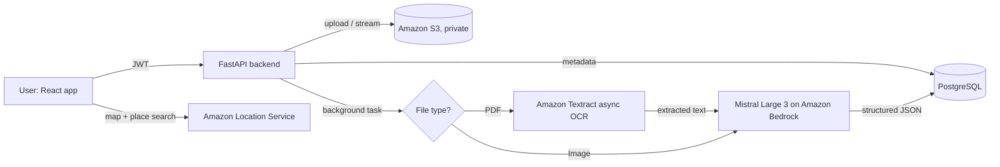

# ABHA-Sync

> AI-powered health-record assistant that turns paper prescriptions and lab reports into structured, plain-language health data, built on Amazon Bedrock and Amazon Textract.

Most Indian patients still carry their medical history on paper. ABHA-Sync lets a patient photograph or upload a prescription or lab report, then uses OCR and a large language model to extract every medicine and test value and explain it in everyday language: what each medicine is for, how to take it, which results are out of range, and when to see a doctor. The long-term goal is to make these records ready for India's Ayushman Bharat Digital Mission (ABDM).

Built for the **AWS AI for Bharat Hackathon**.

<!-- Add a demo GIF or screenshots here, e.g.:

Live demo: https://your-deployment-url
-->

---

## Features

**Live**

- **Upload medical records**: JPEG, PNG or PDF (up to 10 MB), tagged as a prescription/record, report or lab report, stored in a private Amazon S3 bucket.
- **OCR for PDFs**: Amazon Textract's asynchronous text-detection API reads multi-page PDFs directly from S3 and collects text across paginated results.
- **Vision-LLM analysis for images**: photos of prescriptions and reports go straight to a vision-capable LLM (Mistral Large 3 on Amazon Bedrock).
- **Document-specific prompts with structured JSON output**:
    - *Prescriptions*: each medicine's purpose, dosage, frequency, duration, timing, side effects, warnings and food interactions.
    - *Lab reports*: each parameter's value, reference range, status (normal, high, low, critical), plain-language meaning and suggested action, plus abnormal findings, diet and lifestyle tips and doctor-visit urgency.
    - *Other medical documents*: summary, key findings and recommendations.
- **Asynchronous processing**: analysis runs as a background task with a status lifecycle (`pending`, `completed`, `failed`); completed results are cached and not re-run.
- **Resilient output parsing**: strips markdown fences from model output and falls back to a safe error object that keeps the raw response when JSON parsing fails.
- **Swappable LLM provider**: `AI_SERVICE=bedrock` (default) or `AI_SERVICE=nvidia` (NVIDIA Inference API, OpenAI-compatible) with no code changes.
- **Secure file access**: files are streamed through an authenticated backend proxy with per-user ownership checks; S3 is never exposed publicly.
- **Authentication**: email and password sign-up with bcrypt hashing, JWT access tokens and 7-day refresh tokens.
- **Nearest Jan Aushadhi Kendra finder**: map and place search for affordable generic-medicine stores, using Amazon Location Service and MapLibre GL.

**In beta (UI ready, backend in progress)**

Consent management, medicine reminders, cost-savings insights and settings. These screens are visible but marked "Beta" in the app.

---

## Architecture



**Analysis flow**

1. The user uploads a file; the backend validates type and size, stores it in S3 and saves metadata in PostgreSQL.
2. `POST /records/{id}/analyze` marks the record `pending` and returns immediately.
3. A background worker picks the path by file type: PDFs go through Textract OCR, then a text prompt; images go to the vision model directly.
4. The model returns JSON matching a schema chosen by document type; the result is saved and the status becomes `completed` (or `failed`).
5. The frontend polls the record and renders the explanation.

---

## Tech Stack

| Layer | Technology |
|-------|------------|
| Frontend | React 18, Vite, Tailwind CSS, Recharts, MapLibre GL |
| Backend | Python 3.11, FastAPI, SQLAlchemy 2, Pydantic v2 |
| Database | PostgreSQL 15 |
| File storage | Amazon S3 (private bucket) |
| OCR | Amazon Textract (asynchronous text detection) |
| LLM | Mistral Large 3 via Amazon Bedrock (optional: NVIDIA Inference API) |
| Maps | Amazon Location Service |
| Auth | JWT (python-jose) + bcrypt (passlib) |
| Infrastructure | Docker Compose (local), AWS App Runner (backend), Vercel (frontend) |

---

## Quick Start

### 1. Prerequisites

- Docker Desktop
- An AWS account with access to **S3**, **Textract** and **Bedrock** (Mistral Large 3 enabled in your Bedrock region)
- Optional: an Amazon Location Service API key for the Kendra map

### 2. Configure environment variables

```bash
cp .env.example .env
```

| Variable | Purpose |
|----------|---------|
| `POSTGRES_USER`, `POSTGRES_PASSWORD`, `POSTGRES_DB` | Local PostgreSQL credentials |
| `SECRET_KEY` | Secret used to sign JWTs; use a long random string |
| `CORS_ORIGINS` | Allowed frontend origins, comma-separated |
| `AWS_ACCESS_KEY_ID`, `AWS_SECRET_ACCESS_KEY` | AWS credentials |
| `AWS_S3_BUCKET_NAME`, `AWS_S3_REGION` | S3 bucket for uploaded records |
| `AWS_TEXTRACT_REGION` | Must match the S3 bucket region |
| `AWS_BEDROCK_REGION` | Region where your Bedrock model is enabled |
| `AI_SERVICE` | `bedrock` (default) or `nvidia` |
| `NVIDIA_API_KEY` | Required only when `AI_SERVICE=nvidia` |
| `VITE_AWS_LOCATION_API_KEY` | Amazon Location Service key for the Kendra map |

### 3. Start the stack

```bash
docker compose up --build
```

| Service | URL |
|---------|-----|
| Frontend | http://localhost:3000 |
| Backend API | http://localhost:8000 |
| API docs (Swagger) | http://localhost:8000/docs |
| ReDoc | http://localhost:8000/redoc |

---

## API Endpoints

All routes are prefixed with `/api/v1` except `/health`.

| Method | Path | Description |
|--------|------|-------------|
| `POST` | `/auth/signup` | Create an account (email, password) |
| `POST` | `/auth/login` | Log in and receive access and refresh tokens |
| `POST` | `/auth/refresh` | Get a new access token |
| `POST` | `/auth/logout` | Log out |
| `GET` | `/auth/me` | Current user profile |
| `POST` | `/records/upload` | Upload a record (multipart: `file`, `record_type`, `notes`) |
| `GET` | `/records` | List the current user's records |
| `GET` | `/records/{id}` | Get one record with its AI analysis |
| `POST` | `/records/{id}/analyze` | Start AI analysis in the background |
| `GET` | `/records/{id}/file?token=...` | Stream the original file securely |
| `DELETE` | `/records/{id}` | Delete a record from S3 and the database |
| `GET` | `/health` | Health check |

---

## Project Structure

```
abha-sync/
├── backend/
│   ├── app/
│   │   ├── core/
│   │   │   ├── bedrock_client.py     # Bedrock (Mistral Large 3) prompts + calls
│   │   │   ├── custom_ai_client.py   # NVIDIA Inference API alternative
│   │   │   ├── textract_client.py    # Async Textract OCR for PDFs
│   │   │   ├── s3_client.py          # Upload, download, delete, presigned URLs
│   │   │   ├── security.py           # bcrypt hashing + JWT helpers
│   │   │   ├── config.py             # Settings from environment
│   │   │   └── database.py           # SQLAlchemy engine + session
│   │   ├── middleware/auth.py        # JWT bearer dependency
│   │   ├── models/                   # User, MedicalRecord
│   │   ├── routers/                  # auth.py, records.py
│   │   ├── schemas/                  # Pydantic request/response models
│   │   └── main.py                   # FastAPI app entrypoint
│   ├── apprunner.yaml                # AWS App Runner config
│   ├── Dockerfile
│   └── requirements.txt
├── frontend/
│   ├── src/
│   │   ├── components/               # FileUpload, JanAushadhiMap, DataTable, BetaFeature, ...
│   │   ├── context/                  # AuthContext, RecordsContext
│   │   ├── pages/                    # Dashboard, Upload, ReviewExtraction, ReportExplanation,
│   │   │                             # Timeline, NearestKendra, Consent, Reminders, CostSavings, Settings
│   │   └── services/api.js           # API client
│   ├── vercel.json                   # Vercel config + Amazon Location proxy
│   ├── nginx.conf
│   └── Dockerfile
├── .kiro/specs/abha-sync/            # Requirements and design specs
├── docker-compose.yml
├── .env.example
└── LICENSE
```

---

## Development (without Docker)

### Backend

```bash
cd backend
python -m venv .venv
source .venv/bin/activate        # Windows: .venv\Scripts\activate
pip install -r requirements.txt
cp ../.env.example .env          # fill in your values
uvicorn app.main:app --reload --port 8000
```

### Frontend

```bash
cd frontend
npm install
npm run dev
```

Start the backend first so the frontend's API calls resolve.

---

## Roadmap

- [ ] ABHA number linking and record sharing with ABDM-compliant systems
- [ ] Consent management and medicine reminders (backend for the beta screens)
- [ ] Health timeline built from analysed records
- [ ] Evaluation set of real prescriptions and lab reports to measure extraction accuracy
- [ ] Support for regional languages in explanations

---

## Disclaimer

ABHA-Sync explains medical documents in plain language for general understanding only. It is not a medical device and does not replace advice from a qualified doctor. Always consult a healthcare professional before acting on any result.

## License

[MIT](LICENSE) © 2026 Shubham Hirani
